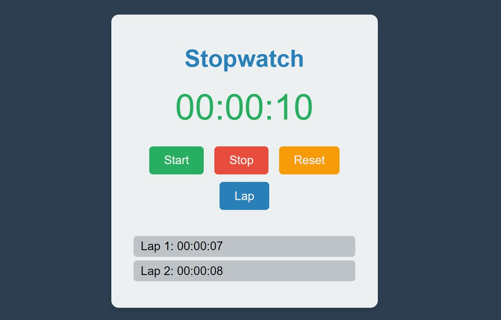

# SCT_WD_2
Task 2 : Building a stop watch web application

# Stopwatch Web Application

A simple and interactive stopwatch web application built with HTML, CSS, and JavaScript. The application includes functionalities for starting, stopping, resetting, and recording lap times.

## Features

- **Start**: Begin timing.
- **Stop**: Pause the timer.
- **Reset**: Clear the timer and lap records.
- **Lap**: Record the current time without stopping the timer.

## Technologies Used

- **HTML**: For structuring the web application.
- **CSS**: For styling the web application with a modern and visually appealing design.
- **JavaScript**: For implementing the stopwatch functionalities.

## Preview

## Getting Started

### Prerequisites

To run this project, you need a web browser (e.g., Chrome, Firefox, Edge).

